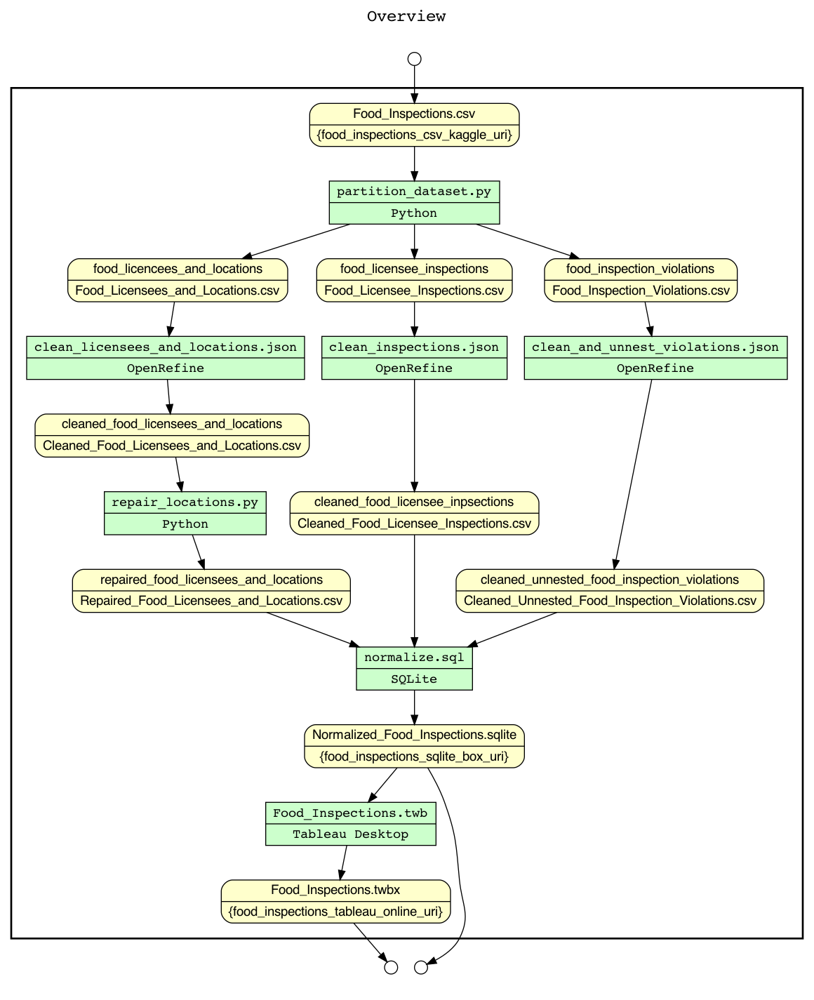
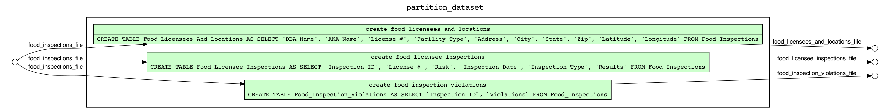
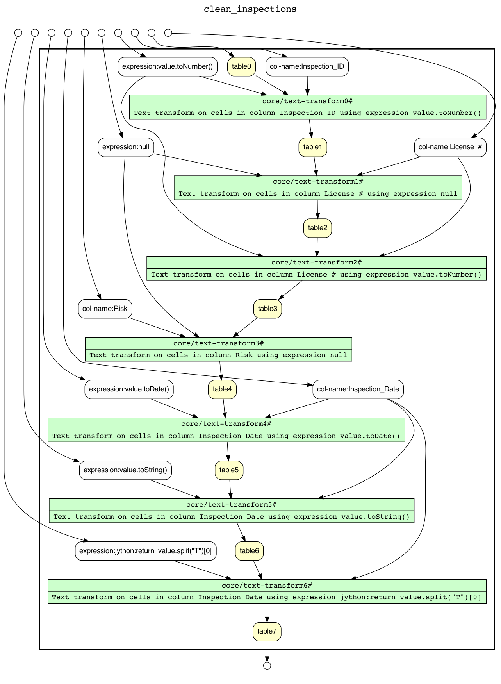
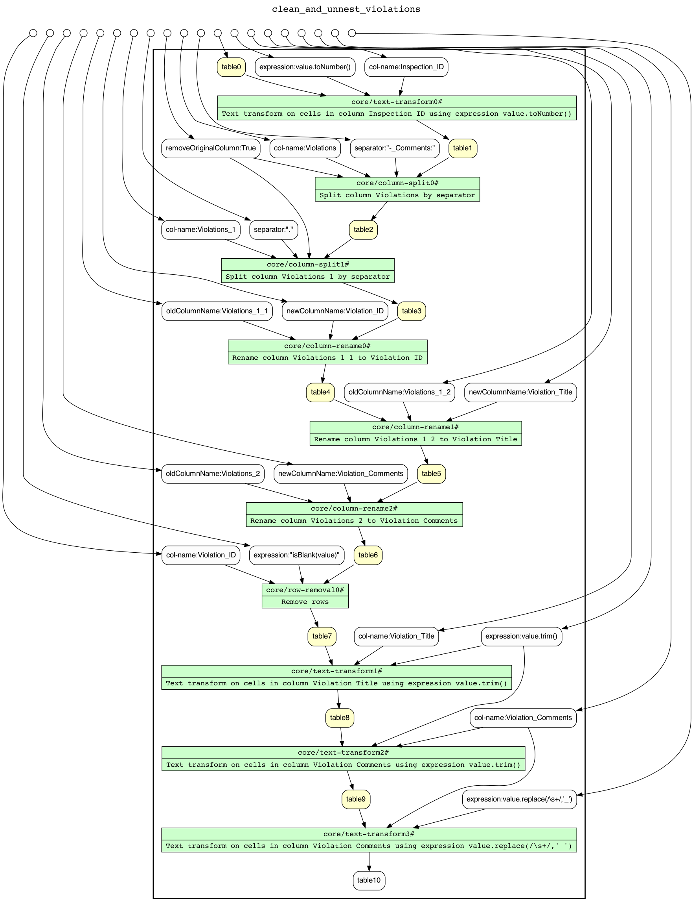
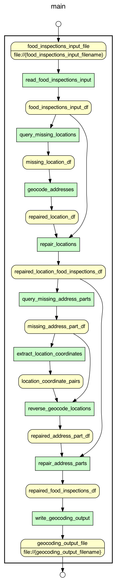
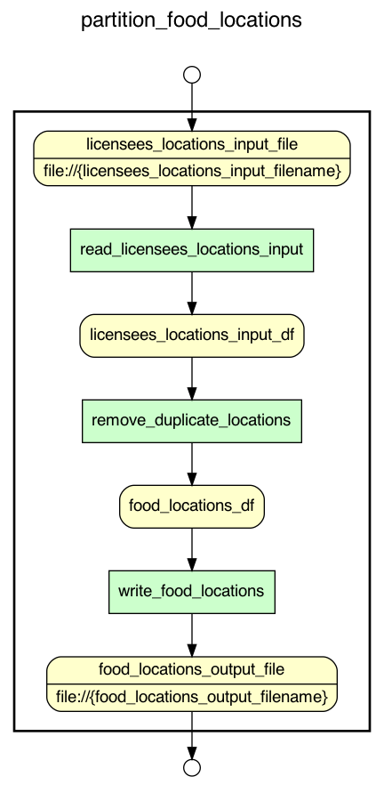
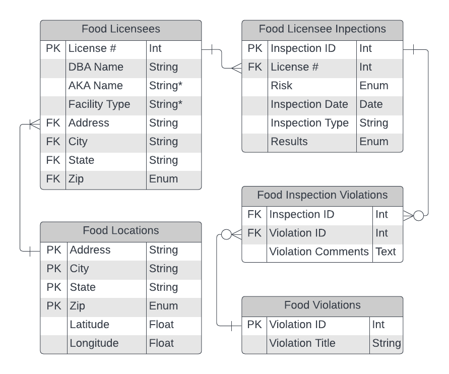

# CS 513 Data Cleaning - Team 152

## Setup

### Prerequisites

* [OpenRefine == 3.4.1](https://github.com/OpenRefine/OpenRefine/releases/tag/3.4.1)
* [YesWorkflow](https://github.com/yesworkflow-org/yw-prototypes) (including [GraphViz](https://github.com/yesworkflow-org/yw-prototypes#2--install-graphviz-visualization-software))
* [OR2YWTool](https://github.com/LanLi2017/OR2YWTool) (also included via `requirements.txt`)
* [SQLite >= 3.38](https://www.sqlite.org/index.html) (or `brew install sqlite`)

### Requirements

```sh
python -m venv env
env/bin/pip install -r requirements.txt
```

## Workflow

### Overview

Generate as follows:

```bash
yw graph -c extract.comment='#' overview.yw > overview.gv
# work around defects in tooling
sed -i '' "s/{<f0> \"/{<f0> /g" overview.gv
sed -i '' "s/\" |<f1>/ |<f1>/g" overview.gv
dot -Tpng overview.gv > overview.png
```



### Partition Dataset

Generate as follows:

```bash
# Note the customization to support long descriptions
yw graph -c extract.comment='#' -c graph.layout=LR -c graph.view=PROCESS partition_dataset.py > partition_dataset.gv
dot -Tpng partition_dataset.gv > partition_dataset.png
```



### Clean Licensees and Locations

Generate as follows:

```bash
or2yw -title "clean_licensees_and_locations" -i clean_licensees_and_locations.json -o clean_licensees_and_locations.yw
yw graph -c extract.comment='#' clean_licensees_and_locations.yw > clean_licensees_and_locations.gv
# work around defects in tooling
sed -i '' "s/{<f0> \"/{<f0> /g" clean_licensees_and_locations.gv
sed -i '' "s/\" |<f1>/ |<f1>/g" clean_licensees_and_locations.gv
dot -Tpng clean_licensees_and_locations.gv > clean_licensees_and_locations.png
```


### Clean Inspections

Generate as follows:

```bash
or2yw -title "clean_inspections" -i clean_inspections.json -o clean_inspections.yw
yw graph -c extract.comment='#' clean_inspections.yw > clean_inspections.gv
# work around defects in tooling
sed -i '' "s/{<f0> \"/{<f0> /g" clean_inspections.gv
sed -i '' "s/\" |<f1>/ |<f1>/g" clean_inspections.gv
dot -Tpng clean_inspections.gv > clean_inspections.png
```



### Clean and Unnest Violations

Generate as follows:

```bash
or2yw -title "clean_and_unnest_violations" -i clean_and_unnest_violations.json -o clean_and_unnest_violations.yw
yw graph -c extract.comment='#' clean_and_unnest_violations.yw > clean_and_unnest_violations.gv
# work around defects in tooling
sed -i '' "s/{<f0> \"/{<f0> /g" clean_and_unnest_violations.gv
sed -i '' "s/\" |<f1>/ |<f1>/g" clean_and_unnest_violations.gv
dot -Tpng clean_and_unnest_violations.gv > clean_and_unnest_violations.png
```

> **TODO:** Figure out why `core/multivalued-cell-split` and `core/fill-down` were ommitted from the diagram.



### Repair Locations

```bash
yw graph repair_location.py -config graph.view=combined -config graph.layout=TB > repair_location.gv
dot -Tpng repair_location.gv > repair_location.png
```



### Partition Food Locations

```bash
yw graph partition_food_locations.py -config graph.view=combined -config graph.layout=TB > partition_food_locations.gv
dot -Tpng partition_food_locations.gv > partition_food_locations.png
```



### Normalize

> **NOTE:** This sub-workflow is from a prototype, and is acting as a placeholder. Naming convention and generation instructions will be updated with the new implementation.

Download from [CS513 Data Cleaning](https://uillinoisedu-my.sharepoint.com/:f:/g/personal/dmcguire_illinois_edu/Ek8ZzambYMZOoGirOveJarMBoXWml2Q6oSnMXG_cbYHleQ?e=OfO3ef)
* `Food_Inspections.csv` (original)
* `Cleaned_Food_Licensee_Inspections.csv`
* `Cleaned_Food_Licensees_and_Locations.csv`
* `Cleaned_and_Unnested_Food_Inspection_Violations.csv`
* `Repaired_Food_Licensees_and_Locations.csv`
* `Food_Locations.csv`

```sh
sqlite3 Food_Inspections.sqlite
sqlite> .read Food_Inspections.sql
sqlite> .read Cleaned_Food_Licensee_Inspections.sql
sqlite> .read Cleaned_Food_Licensees_and_Locations.sql
sqlite> .read Cleaned_and_Unnested_Food_Inspection_Violations.sql
sqlite> .read Repaired_Food_Licensees_and_Locations.sql
sqlite> .read Food_Locations.sql
```

### Visualize
> **TODO:** Documentation of queries specific to use case 1 (U1)

## Schema

Edit Information:

```
Come collaborate on my Lucidchart document!

Join at https://lucid.app/join

Enter Join ID
PJQ P7F
```


