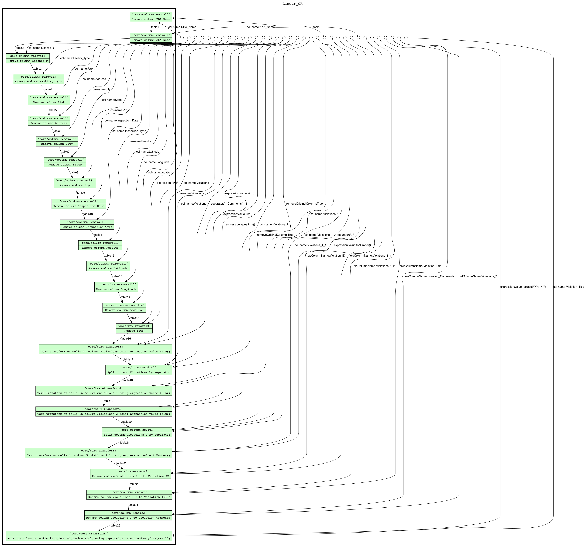
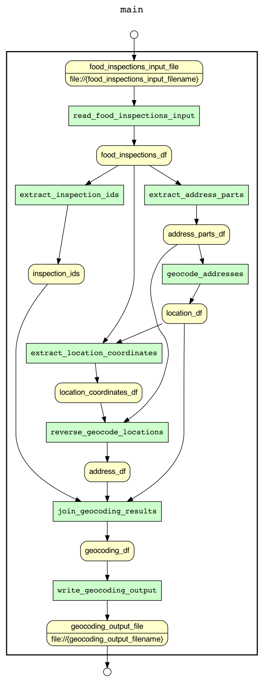

# CS 513 Data Cleaning - Team 152

## Setup

### Prerequisites

* [OpenRefine == 3.4.1](https://github.com/OpenRefine/OpenRefine/releases/tag/3.4.1)
* [YesWorkflow](https://github.com/yesworkflow-org/yw-prototypes) (including [GraphViz](https://github.com/yesworkflow-org/yw-prototypes#2--install-graphviz-visualization-software))
* [OR2YWTool](https://github.com/LanLi2017/OR2YWTool) (also included via `requirements.txt`)
* [SQLite >= 3.38](https://www.sqlite.org/index.html) (or `brew install sqlite`)

### Requirements

```sh
python -m venv env
env/bin/pip install -r requirements.txt
```

## Workflow

### Overview

Generate as follows:

```bash
yw graph -c extract.comment='#' -c graph.layout=TB overview.yw > overview.gv
# work around defects in tooling
sed -i '' "s/{<f0> \"/{<f0> /g" overview.gv
sed -i '' "s/\" |<f1>/ |<f1>/g" overview.gv
dot -Tpng overview.gv > overview.png
```


### Partition Dataset
> **TODO:** Sub-workflow documention

### Clean Locations
> **TODO:** Sub-workflow documention

### Clean Inspections
> **TODO:** Sub-workflow documention

### Clean Violations

> **NOTE:** This sub-workflow is from a prototype, and is acting as a placeholder. Naming convention and generation instructions will be updated with the new implementation.

Generate as follows:

```bash
or2yw -i violations.json -o violations.yw
yw graph -c extract.comment='#' -c graph.layout=TB violations.yw > violations.gv
# work around defects in tooling
sed -i '' "s/{<f0> \"/{<f0> /g" violations.gv
sed -i '' "s/\" |<f1>/ |<f1>/g" violations.gv
dot -Tpng violations.gv > violations.png
```



### Repair Locations

> **NOTE:** This sub-workflow is from a prototype, and is acting as a placeholder. Naming convention and generation instructions will be updated with the new implementation.

```bash
yw graph -c extract.comment='#' geocode.py > geocode.gv
dot -Tpng geocode.gv > geocode.png
```



### Normalize

> **NOTE:** This sub-workflow is from a prototype, and is acting as a placeholder. Naming convention and generation instructions will be updated with the new implementation.

Download from [CS513 Data Cleaning](https://uillinoisedu-my.sharepoint.com/:f:/g/personal/dmcguire_illinois_edu/Ek8ZzambYMZOoGirOveJarMBoXWml2Q6oSnMXG_cbYHleQ?e=OfO3ef)
* `Food_Inspections.csv`
* `Food_Inspections_Violations.csv`

```sh
sqlite3 Food_Inspections.sqlite
sqlite> .read Food_Inspections.sql
sqlite> .read Food_Inspections_Violations.sql
```

### Visualize
> **TODO:** Documentation of queries specific to use case 1 (U1)

## Schema

Edit Information:

```
Come collaborate on my Lucidchart document!

Join at https://lucid.app/join

Enter Join ID
PJQ P7F
```


