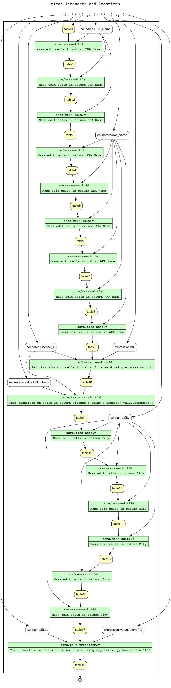

# CS 513 Data Cleaning - Team 152

## Setup

### Prerequisites

* [OpenRefine == 3.4.1](https://github.com/OpenRefine/OpenRefine/releases/tag/3.4.1)
* [YesWorkflow](https://github.com/yesworkflow-org/yw-prototypes) (including [GraphViz](https://github.com/yesworkflow-org/yw-prototypes#2--install-graphviz-visualization-software))
* [OR2YWTool](https://github.com/LanLi2017/OR2YWTool) (also included via `requirements.txt`)
* [SQLite >= 3.38](https://www.sqlite.org/index.html) (or `brew install sqlite`)

### Requirements

```sh
python -m venv env
env/bin/pip install -r requirements.txt
```

## Workflow

### Overview

Generate as follows:

```bash
yw graph -c extract.comment='#' overview.yw > overview.gv
# work around defects in tooling
sed -i '' "s/{<f0> \"/{<f0> /g" overview.gv
sed -i '' "s/\" |<f1>/ |<f1>/g" overview.gv
dot -Tpng overview.gv > overview.png
```


### Partition Dataset

Generate as follows:

```bash
# Note the customization to support long descriptions
yw graph -c extract.comment='#' -c graph.layout=LR -c graph.view=PROCESS partition_dataset.py > partition_dataset.gv
dot -Tpng partition_dataset.gv > partition_dataset.png
```


### Clean Licensees and Locations

Generate as follows:

```bash
or2yw -title "clean_licensees_and_locations" -i clean_licensees_and_locations.json -o clean_licensees_and_locations.yw
yw graph -c extract.comment='#' clean_licensees_and_locations.yw > clean_licensees_and_locations.gv
# work around defects in tooling
sed -i '' "s/{<f0> \"/{<f0> /g" clean_licensees_and_locations.gv
sed -i '' "s/\" |<f1>/ |<f1>/g" clean_licensees_and_locations.gv
dot -Tpng clean_licensees_and_locations.gv > clean_licensees_and_locations.png
```



### Clean Inspections

Generate as follows:

```bash
or2yw -title "clean_inspections" -i clean_inspections.json -o clean_inspections.yw
yw graph -c extract.comment='#' clean_inspections.yw > clean_inspections.gv
# work around defects in tooling
sed -i '' "s/{<f0> \"/{<f0> /g" clean_inspections.gv
sed -i '' "s/\" |<f1>/ |<f1>/g" clean_inspections.gv
dot -Tpng clean_inspections.gv > clean_inspections.png
```


### Clean and Unnest Violations

Generate as follows:

```bash
or2yw -title "clean_and_unnest_violations" -i clean_and_unnest_violations.json -o clean_and_unnest_violations.yw
yw graph -c extract.comment='#' clean_and_unnest_violations.yw > clean_and_unnest_violations.gv
# work around defects in tooling
sed -i '' "s/{<f0> \"/{<f0> /g" clean_and_unnest_violations.gv
sed -i '' "s/\" |<f1>/ |<f1>/g" clean_and_unnest_violations.gv
dot -Tpng clean_and_unnest_violations.gv > clean_and_unnest_violations.png
```

> **TODO:** Figure out why `core/multivalued-cell-split` and `core/fill-down` were ommitted from the diagram.


### Repair Locations

```bash
yw graph repair_location.py -config graph.view=combined -config graph.layout=TB > repair_location.gv
dot -Tpng repair_location.gv > repair_location.png
```


### Partition Food Locations

```bash
yw graph partition_food_locations.py -config graph.view=combined -config graph.layout=TB > partition_food_locations.gv
dot -Tpng partition_food_locations.gv > partition_food_locations.png
```


### Normalize

```bash
yw graph normalize.sql -c extract.comment='--' > normalize.gv
dot -Tpng normalize.gv -o normalize.png
```

```sh
sqlite3 Normalized_Food_Inspections.sqlite
sqlite> .read Repaired_Food_Licensees_and_Locations.sql
sqlite> .read Cleaned_Food_Licensee_Inspections.sql
sqlite> .read Cleaned_and_Unnested_Food_Inspection_Violations.sql
sqlite> .read normalize.sql
```


Download from [CS513 Data Cleaning](https://uillinoisedu-my.sharepoint.com/:f:/g/personal/dmcguire_illinois_edu/Ek8ZzambYMZOoGirOveJarMBoXWml2Q6oSnMXG_cbYHleQ?e=OfO3ef)
* `Food_Inspections.csv` (original)
* `Cleaned_Food_Licensee_Inspections.csv`
* `Cleaned_Food_Licensees_and_Locations.csv`
* `Cleaned_and_Unnested_Food_Inspection_Violations.csv`
* `Repaired_Food_Licensees_and_Locations.csv`
* `Normalized_Food_Inspections.sqlite` (cleaned & normalized)

```sh
sqlite3 Food_Inspections.sqlite
sqlite> .read Food_Inspections.sql
sqlite> .read Cleaned_Food_Licensee_Inspections.sql
sqlite> .read Cleaned_Food_Licensees_and_Locations.sql
sqlite> .read Cleaned_and_Unnested_Food_Inspection_Violations.sql
sqlite> .read Repaired_Food_Licensees_and_Locations.sql
sqlite> .read Food_Locations.sql
```

### Visualize

* (Original dataset) https://public.tableau.com/app/profile/jose.cols/viz/Visualization_16595789943680/Dashboard
* (Cleaned dataset) https://public.tableau.com/app/profile/jose.cols/viz/CleanedVisualization/Dashboard

#### Results

```sql
sqlite> -- Results
SELECT
    Cleaned_Food_Licensee_Inspections."Results" AS "Results",
    Cleaned_Food_Licensee_Inspections."Inspection ID" AS "Inspection ID",
    (
        SELECT count(*) 
        FROM Cleaned_Food_Inspection_Violations
        WHERE Cleaned_Food_Inspection_Violations."Inspection ID" = Cleaned_Food_Licensee_Inspections."Inspection ID"
    ) AS "CNT(Violation ID)",
    Cleaned_Food_Licensees."DBA Name" AS "DBA Name",
    Cleaned_Food_Licensees."Address" AS "Address",
    Cleaned_Food_Licensees."License #" AS "License #"
FROM Cleaned_Food_Licensee_Inspections
INNER JOIN Cleaned_Food_Licensees
ON Cleaned_Food_Licensee_Inspections."License #" = Cleaned_Food_Licensees."License #"
INNER JOIN Cleaned_Food_Locations
ON Cleaned_Food_Licensees."Address" = Cleaned_Food_Locations."Address"
    AND Cleaned_Food_Licensees."City" = Cleaned_Food_Locations."City"
    AND Cleaned_Food_Licensees."State" = Cleaned_Food_Locations."State"
    AND Cleaned_Food_Licensees."Zip" = Cleaned_Food_Locations."Zip"
WHERE Cleaned_Food_Locations."Latitude" BETWEEN 41.9754 AND 42.0034
    AND Cleaned_Food_Locations."Longitude" BETWEEN -87.8173 AND -87.7284
    AND strftime('%Y-%m', Cleaned_Food_Licensee_Inspections."Inspection Date") = '2010-08'
ORDER BY Cleaned_Food_Licensee_Inspections."Inspection ID";
```

Results|Inspection ID|CNT(Violation ID)|DBA Name|Address|License #
-------|-------------|-----------------|--------|-------|---------
Fail|277887|6|STEERS RESTAURANT|5777 N MILWAUKEE AVE|2048828
Out of Business|277888|0|STEERS GOOD FOOD FAST|5777 N MILWAUKEE AVE|1475876
Pass|278012|5|SUBWAY|4157 W PETERSON AVE|2042108
Pass|278029|6|STEERS RESTAURANT|5777 N MILWAUKEE AVE|2048828
Pass|278145|6|EUROPEAN CLASSIC|5930 N ELSTON AVE|1139389
Pass|278148|7|YELLOW ROSE CAFE INC|5640 N ELSTON AVE|50484
Fail|278174|0|FOSTER CICERO MARATHON|5200-5210 N CICERO AVE|1998962
Fail|278175|5|FOSTER CICERO MARATHON|5200 - 5210 N CICERO AVE|1891690
Fail|284354|9|DON JUAN|6730 N NORTHWEST HWY|5108
Pass w/ Conditions|284403|5|DINO'S PIZZA|7004-7006 W HIGGINS AVE|1254
Pass|284425|3|DUNKIN DONUTS/BASKIN ROBBINS|6342 N MILWAUKEE AVE|64722
Fail|284433|5|FOSTER CICERO MARATHON|5200 - 5210 N CICERO AVE|1891690
Pass|284438|0|FOSTER CICERO MARATHON|5200-5210 N CICERO AVE|1998962
Pass w/ Conditions|284533|3|DINO'S PIZZA|7004-7006 W HIGGINS AVE|1254
Pass|284622|7|DON JUAN|6730 N NORTHWEST HWY|5108
Pass|284901|0|CHINESE KITCHEN|5316 N MILWAUKEE AVE|1740632
Fail|353210|15|FENNIGAN'S|5308-5312 N MILWAUKEE|1975
Pass|361208|3|7 - ELEVEN|5789 N MILWAUKEE AVE|1848194
Fail|361220|5|MIA FIGLIA, INC|5304 W DEVON AVE|2031440
Fail|361221|0|MIA FIGLIA, INC|5304 W DEVON AVE|2031441
Fail|361231|5|SAIGON GRILL|5736 N ELSTON AVE|2042848
Fail|361238|0|PIATTO|5304 W DEVON AVE|1682536
Pass|361239|5|MIA FIGLIA, INC|5304 W DEVON AVE|2031440
Pass|361240|0|MIA FIGLIA, INC|5304 W DEVON AVE|2031441
Pass|361246|4|EAST OF EDENS|6350 N CICERO AVE|23369
Out of Business|361249|0|PIER 5736|5736 N ELSTON AVE|1444395
Pass|361250|5|SAIGON GRILL|5736 N ELSTON AVE|2042848
Pass|361255|1|ALL ABOARD LEARNING EXPRESS|4008 W ROSEMONT AVE|37566
Pass|361256|8|TANZITARO, INC.|6075 N MILWAUKEE AVE|1801496


#### Violations

```sql
sqlite> -- Violations
SELECT
    Cleaned_Food_Inspection_Violations."Violation ID" AS "Violation ID",
    Cleaned_Food_Violations."Violation Title" AS "Violation Title",
    Cleaned_Food_Licensee_Inspections."Inspection ID" AS "Inspection ID",
    Cleaned_Food_Licensees."DBA Name" AS "DBA Name",
    Cleaned_Food_Licensees."Address" AS "Address",
    Cleaned_Food_Licensees."License #" AS "License #"
FROM Cleaned_Food_Inspection_Violations
INNER JOIN Cleaned_Food_Violations
ON Cleaned_Food_Inspection_Violations."Violation ID" = Cleaned_Food_Violations."Violation ID"
INNER JOIN Cleaned_Food_Licensee_Inspections
ON Cleaned_Food_Inspection_Violations."Inspection ID" = Cleaned_Food_Licensee_Inspections."Inspection ID"
INNER JOIN Cleaned_Food_Licensees
ON Cleaned_Food_Licensee_Inspections."License #" = Cleaned_Food_Licensees."License #"
INNER JOIN Cleaned_Food_Locations
ON Cleaned_Food_Licensees."Address" = Cleaned_Food_Locations."Address"
    AND Cleaned_Food_Licensees."City" = Cleaned_Food_Locations."City"
    AND Cleaned_Food_Licensees."State" = Cleaned_Food_Locations."State"
    AND Cleaned_Food_Licensees."Zip" = Cleaned_Food_Locations."Zip"
WHERE Cleaned_Food_Locations."Latitude" BETWEEN 41.9754 AND 42.0034
    AND Cleaned_Food_Locations."Longitude" BETWEEN -87.8173 AND -87.7284
    AND strftime('%Y-%m', Cleaned_Food_Licensee_Inspections."Inspection Date") = '2010-08'
ORDER BY Cleaned_Food_Licensee_Inspections."Inspection ID", Cleaned_Food_Inspection_Violations."Violation ID";
```

Violation ID|Violation Title|Inspection ID|DBA Name|Address|License #
------------|---------------|-------------|--------|-------|---------
2|FACILITIES TO MAINTAIN PROPER TEMPERATURE|277887|STEERS RESTAURANT|5777 N MILWAUKEE AVE|2048828
32|FOOD AND NON-FOOD CONTACT SURFACES PROPERLY DESIGNED, CONSTRUCTED AND MAINTAINED|277887|STEERS RESTAURANT|5777 N MILWAUKEE AVE|2048828
33|FOOD AND NON-FOOD CONTACT EQUIPMENT UTENSILS CLEAN, FREE OF ABRASIVE DETERGENTS|277887|STEERS RESTAURANT|5777 N MILWAUKEE AVE|2048828
34|FLOORS: CONSTRUCTED PER CODE, CLEANED, GOOD REPAIR, COVING INSTALLED, DUST-LESS CLEANING METHODS USED|277887|STEERS RESTAURANT|5777 N MILWAUKEE AVE|2048828
35|WALLS, CEILINGS, ATTACHED EQUIPMENT CONSTRUCTED PER CODE: GOOD REPAIR, SURFACES CLEAN AND DUST-LESS CLEANING METHODS|277887|STEERS RESTAURANT|5777 N MILWAUKEE AVE|2048828
38|VENTILATION: ROOMS AND EQUIPMENT VENTED AS REQUIRED: PLUMBING: INSTALLED AND MAINTAINED|277887|STEERS RESTAURANT|5777 N MILWAUKEE AVE|2048828
33|FOOD AND NON-FOOD CONTACT EQUIPMENT UTENSILS CLEAN, FREE OF ABRASIVE DETERGENTS|278012|SUBWAY|4157 W PETERSON AVE|2042108
34|FLOORS: CONSTRUCTED PER CODE, CLEANED, GOOD REPAIR, COVING INSTALLED, DUST-LESS CLEANING METHODS USED|278012|SUBWAY|4157 W PETERSON AVE|2042108
35|WALLS, CEILINGS, ATTACHED EQUIPMENT CONSTRUCTED PER CODE: GOOD REPAIR, SURFACES CLEAN AND DUST-LESS CLEANING METHODS|278012|SUBWAY|4157 W PETERSON AVE|2042108
38|VENTILATION: ROOMS AND EQUIPMENT VENTED AS REQUIRED: PLUMBING: INSTALLED AND MAINTAINED|278012|SUBWAY|4157 W PETERSON AVE|2042108
41|PREMISES MAINTAINED FREE OF LITTER, UNNECESSARY ARTICLES, CLEANING  EQUIPMENT PROPERLY STORED|278012|SUBWAY|4157 W PETERSON AVE|2042108
2|FACILITIES TO MAINTAIN PROPER TEMPERATURE|278029|STEERS RESTAURANT|5777 N MILWAUKEE AVE|2048828
32|FOOD AND NON-FOOD CONTACT SURFACES PROPERLY DESIGNED, CONSTRUCTED AND MAINTAINED|278029|STEERS RESTAURANT|5777 N MILWAUKEE AVE|2048828
33|FOOD AND NON-FOOD CONTACT EQUIPMENT UTENSILS CLEAN, FREE OF ABRASIVE DETERGENTS|278029|STEERS RESTAURANT|5777 N MILWAUKEE AVE|2048828
34|FLOORS: CONSTRUCTED PER CODE, CLEANED, GOOD REPAIR, COVING INSTALLED, DUST-LESS CLEANING METHODS USED|278029|STEERS RESTAURANT|5777 N MILWAUKEE AVE|2048828
35|WALLS, CEILINGS, ATTACHED EQUIPMENT CONSTRUCTED PER CODE: GOOD REPAIR, SURFACES CLEAN AND DUST-LESS CLEANING METHODS|278029|STEERS RESTAURANT|5777 N MILWAUKEE AVE|2048828
38|VENTILATION: ROOMS AND EQUIPMENT VENTED AS REQUIRED: PLUMBING: INSTALLED AND MAINTAINED|278029|STEERS RESTAURANT|5777 N MILWAUKEE AVE|2048828
2|FACILITIES TO MAINTAIN PROPER TEMPERATURE|278145|EUROPEAN CLASSIC|5930 N ELSTON AVE|1139389
33|FOOD AND NON-FOOD CONTACT EQUIPMENT UTENSILS CLEAN, FREE OF ABRASIVE DETERGENTS|278145|EUROPEAN CLASSIC|5930 N ELSTON AVE|1139389
34|FLOORS: CONSTRUCTED PER CODE, CLEANED, GOOD REPAIR, COVING INSTALLED, DUST-LESS CLEANING METHODS USED|278145|EUROPEAN CLASSIC|5930 N ELSTON AVE|1139389
35|WALLS, CEILINGS, ATTACHED EQUIPMENT CONSTRUCTED PER CODE: GOOD REPAIR, SURFACES CLEAN AND DUST-LESS CLEANING METHODS|278145|EUROPEAN CLASSIC|5930 N ELSTON AVE|1139389
40|REFRIGERATION AND METAL STEM THERMOMETERS PROVIDED AND CONSPICUOUS|278145|EUROPEAN CLASSIC|5930 N ELSTON AVE|1139389
41|PREMISES MAINTAINED FREE OF LITTER, UNNECESSARY ARTICLES, CLEANING  EQUIPMENT PROPERLY STORED|278145|EUROPEAN CLASSIC|5930 N ELSTON AVE|1139389
2|FACILITIES TO MAINTAIN PROPER TEMPERATURE|278148|YELLOW ROSE CAFE INC|5640 N ELSTON AVE|50484
30|FOOD IN ORIGINAL CONTAINER, PROPERLY LABELED: CUSTOMER ADVISORY POSTED AS NEEDED|278148|YELLOW ROSE CAFE INC|5640 N ELSTON AVE|50484
31|CLEAN MULTI-USE UTENSILS AND SINGLE SERVICE ARTICLES PROPERLY STORED: NO REUSE OF SINGLE SERVICE ARTICLES|278148|YELLOW ROSE CAFE INC|5640 N ELSTON AVE|50484
32|FOOD AND NON-FOOD CONTACT SURFACES PROPERLY DESIGNED, CONSTRUCTED AND MAINTAINED|278148|YELLOW ROSE CAFE INC|5640 N ELSTON AVE|50484
33|FOOD AND NON-FOOD CONTACT EQUIPMENT UTENSILS CLEAN, FREE OF ABRASIVE DETERGENTS|278148|YELLOW ROSE CAFE INC|5640 N ELSTON AVE|50484
34|FLOORS: CONSTRUCTED PER CODE, CLEANED, GOOD REPAIR, COVING INSTALLED, DUST-LESS CLEANING METHODS USED|278148|YELLOW ROSE CAFE INC|5640 N ELSTON AVE|50484
35|WALLS, CEILINGS, ATTACHED EQUIPMENT CONSTRUCTED PER CODE: GOOD REPAIR, SURFACES CLEAN AND DUST-LESS CLEANING METHODS|278148|YELLOW ROSE CAFE INC|5640 N ELSTON AVE|50484
24|DISH WASHING FACILITIES: PROPERLY DESIGNED, CONSTRUCTED, MAINTAINED, INSTALLED, LOCATED AND OPERATED|278175|FOSTER CICERO MARATHON|5200 - 5210 N CICERO AVE|1891690
26|ADEQUATE NUMBER, CONVENIENT, ACCESSIBLE, PROPERLY DESIGNED AND INSTALLED|278175|FOSTER CICERO MARATHON|5200 - 5210 N CICERO AVE|1891690
35|WALLS, CEILINGS, ATTACHED EQUIPMENT CONSTRUCTED PER CODE: GOOD REPAIR, SURFACES CLEAN AND DUST-LESS CLEANING METHODS|278175|FOSTER CICERO MARATHON|5200 - 5210 N CICERO AVE|1891690
38|VENTILATION: ROOMS AND EQUIPMENT VENTED AS REQUIRED: PLUMBING: INSTALLED AND MAINTAINED|278175|FOSTER CICERO MARATHON|5200 - 5210 N CICERO AVE|1891690
40|REFRIGERATION AND METAL STEM THERMOMETERS PROVIDED AND CONSPICUOUS|278175|FOSTER CICERO MARATHON|5200 - 5210 N CICERO AVE|1891690
2|FACILITIES TO MAINTAIN PROPER TEMPERATURE|284354|DON JUAN|6730 N NORTHWEST HWY|5108
3|POTENTIALLY HAZARDOUS FOOD MEETS TEMPERATURE REQUIREMENT DURING STORAGE, PREPARATION DISPLAY AND SERVICE|284354|DON JUAN|6730 N NORTHWEST HWY|5108
16|FOOD PROTECTED DURING STORAGE, PREPARATION, DISPLAY, SERVICE AND TRANSPORTATION|284354|DON JUAN|6730 N NORTHWEST HWY|5108
26|ADEQUATE NUMBER, CONVENIENT, ACCESSIBLE, PROPERLY DESIGNED AND INSTALLED|284354|DON JUAN|6730 N NORTHWEST HWY|5108
32|FOOD AND NON-FOOD CONTACT SURFACES PROPERLY DESIGNED, CONSTRUCTED AND MAINTAINED|284354|DON JUAN|6730 N NORTHWEST HWY|5108
33|FOOD AND NON-FOOD CONTACT EQUIPMENT UTENSILS CLEAN, FREE OF ABRASIVE DETERGENTS|284354|DON JUAN|6730 N NORTHWEST HWY|5108
35|WALLS, CEILINGS, ATTACHED EQUIPMENT CONSTRUCTED PER CODE: GOOD REPAIR, SURFACES CLEAN AND DUST-LESS CLEANING METHODS|284354|DON JUAN|6730 N NORTHWEST HWY|5108
38|VENTILATION: ROOMS AND EQUIPMENT VENTED AS REQUIRED: PLUMBING: INSTALLED AND MAINTAINED|284354|DON JUAN|6730 N NORTHWEST HWY|5108
44|ONLY AUTHORIZED PERSONNEL IN THE FOOD-PREP AREA|284354|DON JUAN|6730 N NORTHWEST HWY|5108
2|FACILITIES TO MAINTAIN PROPER TEMPERATURE|284403|DINO'S PIZZA|7004-7006 W HIGGINS AVE|1254
3|POTENTIALLY HAZARDOUS FOOD MEETS TEMPERATURE REQUIREMENT DURING STORAGE, PREPARATION DISPLAY AND SERVICE|284403|DINO'S PIZZA|7004-7006 W HIGGINS AVE|1254
32|FOOD AND NON-FOOD CONTACT SURFACES PROPERLY DESIGNED, CONSTRUCTED AND MAINTAINED|284403|DINO'S PIZZA|7004-7006 W HIGGINS AVE|1254
33|FOOD AND NON-FOOD CONTACT EQUIPMENT UTENSILS CLEAN, FREE OF ABRASIVE DETERGENTS|284403|DINO'S PIZZA|7004-7006 W HIGGINS AVE|1254
35|WALLS, CEILINGS, ATTACHED EQUIPMENT CONSTRUCTED PER CODE: GOOD REPAIR, SURFACES CLEAN AND DUST-LESS CLEANING METHODS|284403|DINO'S PIZZA|7004-7006 W HIGGINS AVE|1254
33|FOOD AND NON-FOOD CONTACT EQUIPMENT UTENSILS CLEAN, FREE OF ABRASIVE DETERGENTS|284425|DUNKIN DONUTS/BASKIN ROBBINS|6342 N MILWAUKEE AVE|64722
34|FLOORS: CONSTRUCTED PER CODE, CLEANED, GOOD REPAIR, COVING INSTALLED, DUST-LESS CLEANING METHODS USED|284425|DUNKIN DONUTS/BASKIN ROBBINS|6342 N MILWAUKEE AVE|64722
36|LIGHTING: REQUIRED MINIMUM FOOT-CANDLES OF LIGHT PROVIDED, FIXTURES SHIELDED|284425|DUNKIN DONUTS/BASKIN ROBBINS|6342 N MILWAUKEE AVE|64722
24|DISH WASHING FACILITIES: PROPERLY DESIGNED, CONSTRUCTED, MAINTAINED, INSTALLED, LOCATED AND OPERATED|284433|FOSTER CICERO MARATHON|5200 - 5210 N CICERO AVE|1891690
26|ADEQUATE NUMBER, CONVENIENT, ACCESSIBLE, PROPERLY DESIGNED AND INSTALLED|284433|FOSTER CICERO MARATHON|5200 - 5210 N CICERO AVE|1891690
35|WALLS, CEILINGS, ATTACHED EQUIPMENT CONSTRUCTED PER CODE: GOOD REPAIR, SURFACES CLEAN AND DUST-LESS CLEANING METHODS|284433|FOSTER CICERO MARATHON|5200 - 5210 N CICERO AVE|1891690
38|VENTILATION: ROOMS AND EQUIPMENT VENTED AS REQUIRED: PLUMBING: INSTALLED AND MAINTAINED|284433|FOSTER CICERO MARATHON|5200 - 5210 N CICERO AVE|1891690
40|REFRIGERATION AND METAL STEM THERMOMETERS PROVIDED AND CONSPICUOUS|284433|FOSTER CICERO MARATHON|5200 - 5210 N CICERO AVE|1891690
32|FOOD AND NON-FOOD CONTACT SURFACES PROPERLY DESIGNED, CONSTRUCTED AND MAINTAINED|284533|DINO'S PIZZA|7004-7006 W HIGGINS AVE|1254
33|FOOD AND NON-FOOD CONTACT EQUIPMENT UTENSILS CLEAN, FREE OF ABRASIVE DETERGENTS|284533|DINO'S PIZZA|7004-7006 W HIGGINS AVE|1254
35|WALLS, CEILINGS, ATTACHED EQUIPMENT CONSTRUCTED PER CODE: GOOD REPAIR, SURFACES CLEAN AND DUST-LESS CLEANING METHODS|284533|DINO'S PIZZA|7004-7006 W HIGGINS AVE|1254
16|FOOD PROTECTED DURING STORAGE, PREPARATION, DISPLAY, SERVICE AND TRANSPORTATION|284622|DON JUAN|6730 N NORTHWEST HWY|5108
26|ADEQUATE NUMBER, CONVENIENT, ACCESSIBLE, PROPERLY DESIGNED AND INSTALLED|284622|DON JUAN|6730 N NORTHWEST HWY|5108
32|FOOD AND NON-FOOD CONTACT SURFACES PROPERLY DESIGNED, CONSTRUCTED AND MAINTAINED|284622|DON JUAN|6730 N NORTHWEST HWY|5108
33|FOOD AND NON-FOOD CONTACT EQUIPMENT UTENSILS CLEAN, FREE OF ABRASIVE DETERGENTS|284622|DON JUAN|6730 N NORTHWEST HWY|5108
35|WALLS, CEILINGS, ATTACHED EQUIPMENT CONSTRUCTED PER CODE: GOOD REPAIR, SURFACES CLEAN AND DUST-LESS CLEANING METHODS|284622|DON JUAN|6730 N NORTHWEST HWY|5108
38|VENTILATION: ROOMS AND EQUIPMENT VENTED AS REQUIRED: PLUMBING: INSTALLED AND MAINTAINED|284622|DON JUAN|6730 N NORTHWEST HWY|5108
44|ONLY AUTHORIZED PERSONNEL IN THE FOOD-PREP AREA|284622|DON JUAN|6730 N NORTHWEST HWY|5108
2|FACILITIES TO MAINTAIN PROPER TEMPERATURE|353210|FENNIGAN'S|5308-5312 N MILWAUKEE|1975
3|POTENTIALLY HAZARDOUS FOOD MEETS TEMPERATURE REQUIREMENT DURING STORAGE, PREPARATION DISPLAY AND SERVICE|353210|FENNIGAN'S|5308-5312 N MILWAUKEE|1975
13|NO EVIDENCE OF RODENT OR INSECT INFESTATION, NO BIRDS, TURTLES OR OTHER ANIMALS|353210|FENNIGAN'S|5308-5312 N MILWAUKEE|1975
14|PREVIOUS SERIOUS VIOLATION CORRECTED, 7-42-090|353210|FENNIGAN'S|5308-5312 N MILWAUKEE|1975
19|OUTSIDE GARBAGE WASTE GREASE AND STORAGE AREA; CLEAN, RODENT PROOF, ALL CONTAINERS COVERED|353210|FENNIGAN'S|5308-5312 N MILWAUKEE|1975
25|TOXIC ITEMS PROPERLY STORED, LABELED AND USED|353210|FENNIGAN'S|5308-5312 N MILWAUKEE|1975
30|FOOD IN ORIGINAL CONTAINER, PROPERLY LABELED: CUSTOMER ADVISORY POSTED AS NEEDED|353210|FENNIGAN'S|5308-5312 N MILWAUKEE|1975
32|FOOD AND NON-FOOD CONTACT SURFACES PROPERLY DESIGNED, CONSTRUCTED AND MAINTAINED|353210|FENNIGAN'S|5308-5312 N MILWAUKEE|1975
33|FOOD AND NON-FOOD CONTACT EQUIPMENT UTENSILS CLEAN, FREE OF ABRASIVE DETERGENTS|353210|FENNIGAN'S|5308-5312 N MILWAUKEE|1975
34|FLOORS: CONSTRUCTED PER CODE, CLEANED, GOOD REPAIR, COVING INSTALLED, DUST-LESS CLEANING METHODS USED|353210|FENNIGAN'S|5308-5312 N MILWAUKEE|1975
35|WALLS, CEILINGS, ATTACHED EQUIPMENT CONSTRUCTED PER CODE: GOOD REPAIR, SURFACES CLEAN AND DUST-LESS CLEANING METHODS|353210|FENNIGAN'S|5308-5312 N MILWAUKEE|1975
37|TOILET ROOM DOORS SELF CLOSING: DRESSING ROOMS WITH LOCKERS PROVIDED: COMPLETE SEPARATION FROM LIVING/SLEEPING QUARTERS|353210|FENNIGAN'S|5308-5312 N MILWAUKEE|1975
38|VENTILATION: ROOMS AND EQUIPMENT VENTED AS REQUIRED: PLUMBING: INSTALLED AND MAINTAINED|353210|FENNIGAN'S|5308-5312 N MILWAUKEE|1975
40|REFRIGERATION AND METAL STEM THERMOMETERS PROVIDED AND CONSPICUOUS|353210|FENNIGAN'S|5308-5312 N MILWAUKEE|1975
41|PREMISES MAINTAINED FREE OF LITTER, UNNECESSARY ARTICLES, CLEANING  EQUIPMENT PROPERLY STORED|353210|FENNIGAN'S|5308-5312 N MILWAUKEE|1975
33|FOOD AND NON-FOOD CONTACT EQUIPMENT UTENSILS CLEAN, FREE OF ABRASIVE DETERGENTS|361208|7 - ELEVEN|5789 N MILWAUKEE AVE|1848194
34|FLOORS: CONSTRUCTED PER CODE, CLEANED, GOOD REPAIR, COVING INSTALLED, DUST-LESS CLEANING METHODS USED|361208|7 - ELEVEN|5789 N MILWAUKEE AVE|1848194
41|PREMISES MAINTAINED FREE OF LITTER, UNNECESSARY ARTICLES, CLEANING  EQUIPMENT PROPERLY STORED|361208|7 - ELEVEN|5789 N MILWAUKEE AVE|1848194
30|FOOD IN ORIGINAL CONTAINER, PROPERLY LABELED: CUSTOMER ADVISORY POSTED AS NEEDED|361220|MIA FIGLIA, INC|5304 W DEVON AVE|2031440
31|CLEAN MULTI-USE UTENSILS AND SINGLE SERVICE ARTICLES PROPERLY STORED: NO REUSE OF SINGLE SERVICE ARTICLES|361220|MIA FIGLIA, INC|5304 W DEVON AVE|2031440
33|FOOD AND NON-FOOD CONTACT EQUIPMENT UTENSILS CLEAN, FREE OF ABRASIVE DETERGENTS|361220|MIA FIGLIA, INC|5304 W DEVON AVE|2031440
34|FLOORS: CONSTRUCTED PER CODE, CLEANED, GOOD REPAIR, COVING INSTALLED, DUST-LESS CLEANING METHODS USED|361220|MIA FIGLIA, INC|5304 W DEVON AVE|2031440
35|WALLS, CEILINGS, ATTACHED EQUIPMENT CONSTRUCTED PER CODE: GOOD REPAIR, SURFACES CLEAN AND DUST-LESS CLEANING METHODS|361220|MIA FIGLIA, INC|5304 W DEVON AVE|2031440
11|ADEQUATE NUMBER, CONVENIENT, ACCESSIBLE, DESIGNED, AND MAINTAINED|361231|SAIGON GRILL|5736 N ELSTON AVE|2042848
33|FOOD AND NON-FOOD CONTACT EQUIPMENT UTENSILS CLEAN, FREE OF ABRASIVE DETERGENTS|361231|SAIGON GRILL|5736 N ELSTON AVE|2042848
34|FLOORS: CONSTRUCTED PER CODE, CLEANED, GOOD REPAIR, COVING INSTALLED, DUST-LESS CLEANING METHODS USED|361231|SAIGON GRILL|5736 N ELSTON AVE|2042848
35|WALLS, CEILINGS, ATTACHED EQUIPMENT CONSTRUCTED PER CODE: GOOD REPAIR, SURFACES CLEAN AND DUST-LESS CLEANING METHODS|361231|SAIGON GRILL|5736 N ELSTON AVE|2042848
38|VENTILATION: ROOMS AND EQUIPMENT VENTED AS REQUIRED: PLUMBING: INSTALLED AND MAINTAINED|361231|SAIGON GRILL|5736 N ELSTON AVE|2042848
30|FOOD IN ORIGINAL CONTAINER, PROPERLY LABELED: CUSTOMER ADVISORY POSTED AS NEEDED|361239|MIA FIGLIA, INC|5304 W DEVON AVE|2031440
31|CLEAN MULTI-USE UTENSILS AND SINGLE SERVICE ARTICLES PROPERLY STORED: NO REUSE OF SINGLE SERVICE ARTICLES|361239|MIA FIGLIA, INC|5304 W DEVON AVE|2031440
33|FOOD AND NON-FOOD CONTACT EQUIPMENT UTENSILS CLEAN, FREE OF ABRASIVE DETERGENTS|361239|MIA FIGLIA, INC|5304 W DEVON AVE|2031440
34|FLOORS: CONSTRUCTED PER CODE, CLEANED, GOOD REPAIR, COVING INSTALLED, DUST-LESS CLEANING METHODS USED|361239|MIA FIGLIA, INC|5304 W DEVON AVE|2031440
35|WALLS, CEILINGS, ATTACHED EQUIPMENT CONSTRUCTED PER CODE: GOOD REPAIR, SURFACES CLEAN AND DUST-LESS CLEANING METHODS|361239|MIA FIGLIA, INC|5304 W DEVON AVE|2031440
30|FOOD IN ORIGINAL CONTAINER, PROPERLY LABELED: CUSTOMER ADVISORY POSTED AS NEEDED|361246|EAST OF EDENS|6350 N CICERO AVE|23369
33|FOOD AND NON-FOOD CONTACT EQUIPMENT UTENSILS CLEAN, FREE OF ABRASIVE DETERGENTS|361246|EAST OF EDENS|6350 N CICERO AVE|23369
34|FLOORS: CONSTRUCTED PER CODE, CLEANED, GOOD REPAIR, COVING INSTALLED, DUST-LESS CLEANING METHODS USED|361246|EAST OF EDENS|6350 N CICERO AVE|23369
35|WALLS, CEILINGS, ATTACHED EQUIPMENT CONSTRUCTED PER CODE: GOOD REPAIR, SURFACES CLEAN AND DUST-LESS CLEANING METHODS|361246|EAST OF EDENS|6350 N CICERO AVE|23369
11|ADEQUATE NUMBER, CONVENIENT, ACCESSIBLE, DESIGNED, AND MAINTAINED|361250|SAIGON GRILL|5736 N ELSTON AVE|2042848
33|FOOD AND NON-FOOD CONTACT EQUIPMENT UTENSILS CLEAN, FREE OF ABRASIVE DETERGENTS|361250|SAIGON GRILL|5736 N ELSTON AVE|2042848
34|FLOORS: CONSTRUCTED PER CODE, CLEANED, GOOD REPAIR, COVING INSTALLED, DUST-LESS CLEANING METHODS USED|361250|SAIGON GRILL|5736 N ELSTON AVE|2042848
35|WALLS, CEILINGS, ATTACHED EQUIPMENT CONSTRUCTED PER CODE: GOOD REPAIR, SURFACES CLEAN AND DUST-LESS CLEANING METHODS|361250|SAIGON GRILL|5736 N ELSTON AVE|2042848
38|VENTILATION: ROOMS AND EQUIPMENT VENTED AS REQUIRED: PLUMBING: INSTALLED AND MAINTAINED|361250|SAIGON GRILL|5736 N ELSTON AVE|2042848
40|REFRIGERATION AND METAL STEM THERMOMETERS PROVIDED AND CONSPICUOUS|361255|ALL ABOARD LEARNING EXPRESS|4008 W ROSEMONT AVE|37566
31|CLEAN MULTI-USE UTENSILS AND SINGLE SERVICE ARTICLES PROPERLY STORED: NO REUSE OF SINGLE SERVICE ARTICLES|361256|TANZITARO, INC.|6075 N MILWAUKEE AVE|1801496
33|FOOD AND NON-FOOD CONTACT EQUIPMENT UTENSILS CLEAN, FREE OF ABRASIVE DETERGENTS|361256|TANZITARO, INC.|6075 N MILWAUKEE AVE|1801496
34|FLOORS: CONSTRUCTED PER CODE, CLEANED, GOOD REPAIR, COVING INSTALLED, DUST-LESS CLEANING METHODS USED|361256|TANZITARO, INC.|6075 N MILWAUKEE AVE|1801496
35|WALLS, CEILINGS, ATTACHED EQUIPMENT CONSTRUCTED PER CODE: GOOD REPAIR, SURFACES CLEAN AND DUST-LESS CLEANING METHODS|361256|TANZITARO, INC.|6075 N MILWAUKEE AVE|1801496
38|VENTILATION: ROOMS AND EQUIPMENT VENTED AS REQUIRED: PLUMBING: INSTALLED AND MAINTAINED|361256|TANZITARO, INC.|6075 N MILWAUKEE AVE|1801496
40|REFRIGERATION AND METAL STEM THERMOMETERS PROVIDED AND CONSPICUOUS|361256|TANZITARO, INC.|6075 N MILWAUKEE AVE|1801496
41|PREMISES MAINTAINED FREE OF LITTER, UNNECESSARY ARTICLES, CLEANING  EQUIPMENT PROPERLY STORED|361256|TANZITARO, INC.|6075 N MILWAUKEE AVE|1801496
43|FOOD (ICE) DISPENSING UTENSILS, WASH CLOTHS PROPERLY STORED|361256|TANZITARO, INC.|6075 N MILWAUKEE AVE|1801496


## Schema

Edit Information:

```
Come collaborate on my Lucidchart document!

Join at https://lucid.app/join

Enter Join ID
PJQ P7F
```


